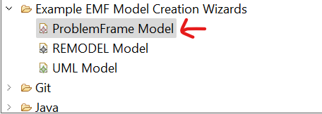
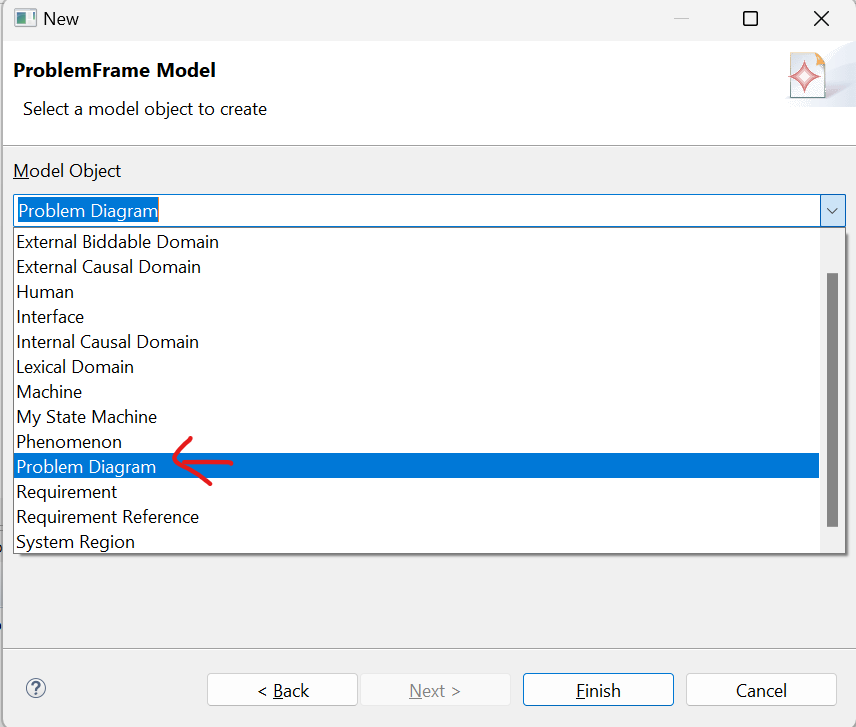
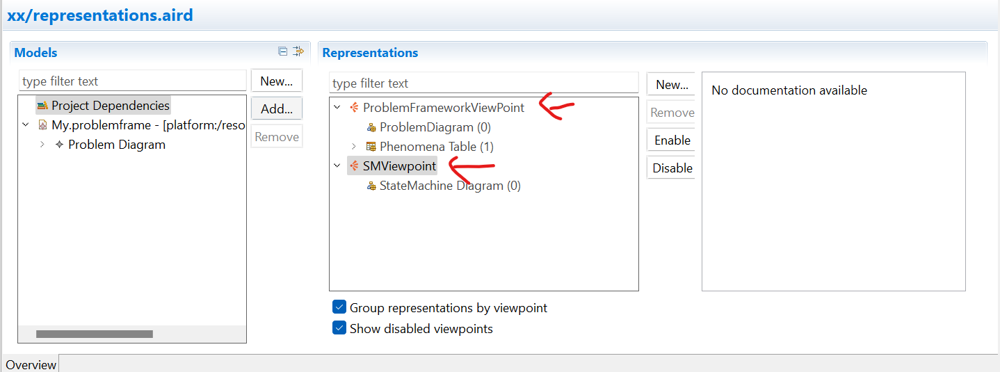
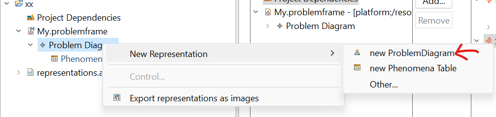

# H-CPS Requirement Modeler
### 1. Install the .zip in your Eclipse Environment

Help->Install new Software -> Add -> Choose the .zip

### 2. Create Project

i. Create a Modeling Project (Right click Model Explorer -> new)
ii. Right Click on the Modeling Project in Model Explorer -> new -> Other...

iii. Choose the ProblemFrame Model -> fill in file name -> Next...

iv. Choose Problem Diagram as first Model Object -> finish

### 3. Setup viewpoints
To make the models present in a visible way, we need to define the viewpoints.

i. Open the representations.aird
ii. Enable both ProblemFrameworkViewPoint and SMViewpoint

iii. You can now right click on the Problem Diagram you created from step 2.iv and create a new representation for it(new ProblemDiagram)

### 4. Start Modeling
You can now use the Modeling Tool to start modeling the requirement models for H-CPS.

The model is divided into two parts: ProblemFrame and StateMachine.

#### **Problem Frame**
ProblemFrame allows you to define internal and external domains(relative to H-CPS), and state the main requirments of H-CPS.

Internal domains: can be used to describe what must be included in H-CPS.
External domains: can be used to describe what is outside of the H-CPS but should be considered in the application context.
Interface: connect domains that have shared phenomena
Requirements: describe requirement and relations to describe which domains should be constrained or referenced to achieve the requirement.

#### **StateMachine**
StateMachine allows you to create state machine that is able to describe human-machine collaboration's transitions depending on the context.

To create a *statemachine representative model*, double click on SystemRegion/ Requirements/ Domains created.

To edit the statemachine, double click again on the *statemachine representative model*.

[(See examples)](/example/)